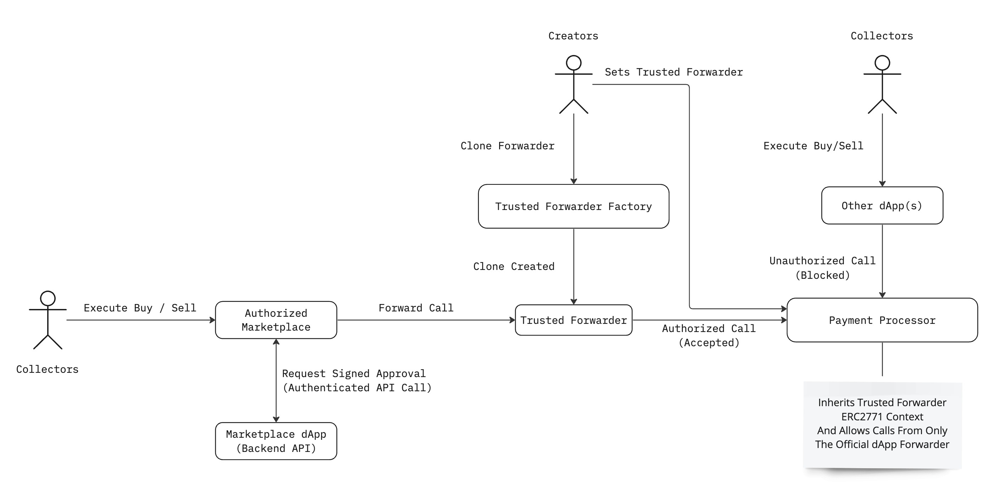

# Trusted Forwarder
Trusted forwarders allow creators and marketplaces the ability to establish channels that become part of the order routing through Payment Processor. Channels allow for more granular trade attribution and metrics as well as the ability to block hostile apps from piggy-backing on the open Payment Processor protocol to vampire attack creators and marketplaces.

There are two modes that a trusted forwarder can operate in - *open* or *permissioned*. In *open* mode the forwarder will relay all transactions with the caller's address appended to the transaction calldata. In *permissioned* mode the forwarder will require the transaction data be signed by an address set by the forwarder's owner in order to be relayed.

Creators may configure Payment Processor to only allow transactions that originate through specific channels (see [add trusted channel](../payment-processor/for-creators/payment-settings#addtrustedchannelforcollection)) which, combined with a permissioned forwarder, allows creators to enforce their sales to be routed through specific frontend interfaces.

## How They Work

Trusted forwarders work by receiving a function call from a user that contains the destination target and calldata to be relayed by the forwarder, appending the caller's address to the calldata and executing the call to the destination. Contracts that receive calls from the trusted forwarder check that the caller is a valid trusted forwarder and extract the original caller's address from the end of the calldata to use in place of the trusted forwarder's address as the caller of the function. See the diagram below for a visual representation of this process.



## Deployment

Trusted Forwarders ***MUST*** be deployed through the Limit Break Trusted Forwarder Factory to be considered a trusted forwarder for Payment Processor.

To deploy a trusted forwarder call the `cloneTrustedForwarder` function the the Trusted Forwarder Factory.

- `admin`: The initial owner of the trusted forwarder. The owner may update the forwarder's signer address, transfer and renounce ownership.
- `appSigner`: For a *permissioned* forwarder this will be the signer address. For an *open* forwarder this must be set to `address(0)`.
- `salt`: A 32-byte hex value that can only be used once per deployer address to create a deterministic deployment address for the trusted forwarder. *Note: Users that are mining a salt value for vanity/optimized addresses should be aware that the provided salt is hashed with their deployer address to determine the salt passed to the CREATE2 instruction.*

```solidity
function cloneTrustedForwarder(
    address admin, 
    address appSigner, 
    bytes32 salt
) external returns (address trustedForwarder)
```

## Management

Trusted forwarders are ownable smart contracts with the initial owner being the account address specified during their deployment. Ownership transfer and renounce follows standard Ownable contract methods.

There are two functions on a trusted forwarder that are restricted to the contract owner - `updateSigner` and `deactivateSigner`.

### Update Signer

`updateSigner` is used for one of two purposes: 
- To change the signer address from `address(0)` to a non-zero address to convert an *open* forwarder to a *permissioned* forwarder.
- To update the signer address from a non-zero address to a different non-zero address if the dApp needs to sign with a different address for any reason.

To make any of the above changes call `updateSigner` directly on the trusted forwarder contract from the account that is the forwarder owner with the appropriate `signer_` parameter value.

### Deactivate Signer

`deactivateSigner` is used to change the signer address from a non-zero address to `address(0)` to convert a *permissioned* forwarder into an *open* forwarder.

To deactivate the signer and convert the trusted forwarder into an *open* forwarder call `deactivateSigner` directly on the trusted forwarder contract from the account that is the forwarder owner.


## Usage

Both *open* and *permissioned* trusted forwarders are designed to work with any smart contract that implements `TrustedForwarderERC2771Context` to create permissioned forwarding channels by routing user calls through the trusted forwarder. Trusted forwarder will *ALWAYS* append the caller of the trusted forwarder to the end of the calldata sent to the target address and forward the entire `msg.value` amount to the target.

*Note: Trusted Forwarders do not have a fallback or receive function so they **CANNOT** receive payments from other contracts to refund excess payment amounts. Contracts that utilize a trusted forwarder should issue refunds directly to the appended caller address as native or wrapped tokens.*

### Open Trusted Forwarder

Steps to execute a call through an *open* trusted forwarder:

1. Determine the target contract address for the call.
2. Determine the calldata for the transaction being sent to the target including the 4-byte function selector.
3. Call the trusted forwarder `forwardCall` with the `target`, `message`, and value to send.

```solidity
function forwardCall(
    address target, 
    bytes calldata message
) external payable returns (bytes memory returnData);
```

### Permissioned Trusted Forwarder

Steps to execute a call through an *open* trusted forwarder:

1. Determine the target contract address for the call.
2. Determine the calldata for the transaction being sent to the target including the 4-byte function selector.
3. Sign the message using the private key for the signer account that is set for the trusted forwarder. 
    - The signature will be for an EIP712 structured message using:
        - The domain separator returned by the `domainSeparatorV4` view function
        - *with*
        - The message data being an AppSigner message defined [here](#appsigner-type-hash).
4. Call the trusted forwarder `forwardCall` with the `target`, `message`, `signature` and value to send.

```solidity
function forwardCall(
    address target, 
    bytes calldata message, 
    SignatureECDSA calldata signature
) external payable returns (bytes memory returnData);
```

#### AppSigner Type Hash

```
AppSigner(bytes32 messageHash,address target,address sender)
```